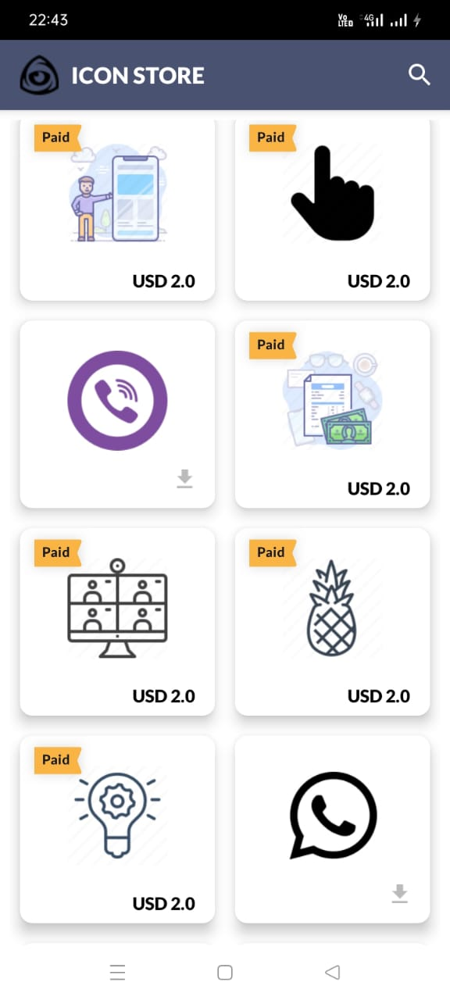

# Icon-Store
<h1 align="center"> Icon Store </h1>

This app does API calling from icon finder API. Also, I have used retrofit  
library, GSON. It has downloading icon feature and also have some paid icons.  
One can search icon with typing keywords in search bar. 

<table align="center">
    <thead>
        <tr>
          <th><b>Screenshots</b></th>
        </tr>
    </thead>
    <tbody >
        <tr>
            <td></td>
        </tr>
    </tbody>
</table>
